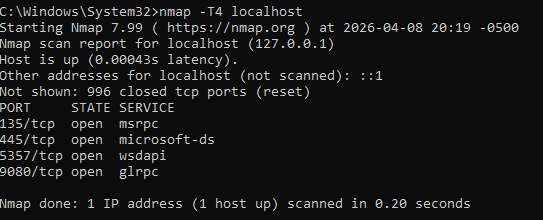

# Network Security Lab

## Overview
This project demonstrates basic network scanning and security analysis using Nmap in a controlled local environment.

## Objective
The goal of this lab is to understand how network scanning works, identify open ports, and analyze potential security risks.

## Tools Used
- Nmap
- Windows OS (Command Prompt)

## What I Did
- Performed a network scan on the local machine
- Identified open ports and associated services
- Analyzed potential security implications

## Sample Scan

Example command used:
```
nmap -T4 localhost
```  
## Scan Result


The screenshot above shows the result of a fast network scan performed on the local machine.

## Findings
- Open ports can indicate active services
- Common ports such as 135 (RPC) and 445 (SMB) are open
- These services are typical for Windows systems

## Analysis
A fast scan using the -T4 option revealed several open ports on the local machine.

- Port 135 (msrpc): Used for Windows Remote Procedure Calls  
- Port 445 (microsoft-ds): Used for file sharing (SMB)  
- Port 5357 (wsdapi): Related to web services for devices  
- Port 9080 (glrpc): Associated with local services  

These ports indicate active services running on the system. While they are normal for Windows, exposed services can become potential security risks if not properly configured or protected.

## What I Learned
- Basics of network scanning
- How to interpret Nmap results
- Importance of monitoring open ports

## Future Improvements
- Perform scans on different network environments
- Explore advanced Nmap options
- Learn vulnerability scanning tools

---

This project is part of my cybersecurity learning journey.
